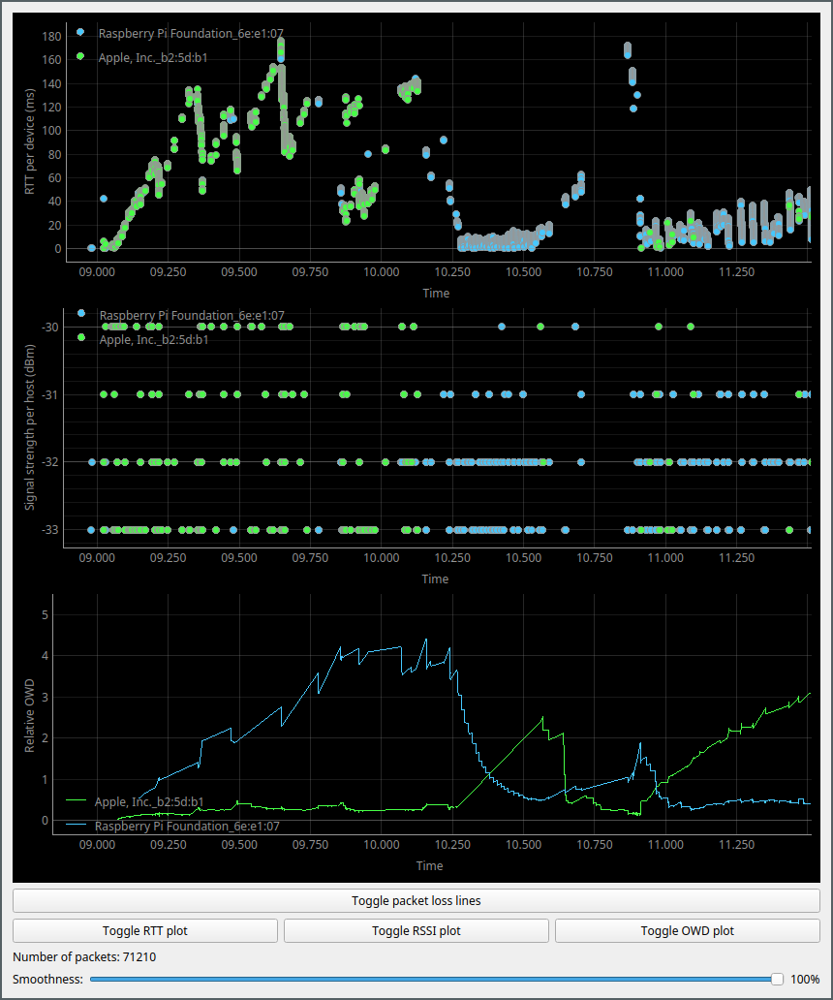

# NETwork Home INTerference
...is a passive measurement tool for home network interference detection.
It uses reliable sources of metrics that can be correlated to create an easily interpreted overview of whether the bottleneck in a connection exists on the local wireless network or not.

This tool was created as part of a master thesis. The report detailing the motivation, development, and features of it can be read in full at [report.pdf](report.pdf).

## Installation

The tool can be downloaded as follows: 
```bash
git clone https://github.com/petternett/NETHINT.git
```

then, install the required Python libraries by running
```bash
cd NETHINT
pip install -r requirements.txt
```


## Usage

After installing, the tool can be run by going into the ``src`` directory and running
```bash
sudo -E python3 main.py
```

All the available arguments can be seen by running ``sudo -E python3 main.py -h``.

Listening to wireless traffic requires a wireless network interface card that is capable of running in Monitor mode.
A guide on how to put an interface in Monitor mode can be [found here.](https://www.aircrack-ng.org/doku.php?id=airmon-ng)

### Interface selection and pcap parsing

NETHINT is capable of either capturing live from an interface or read an existing pcap file.
The available interfaces can be listen by running ``sudo -E python3 main.py -ls``.
The interface can be selected by index, like ``sudo -E python3 main.py [index]``.
If no index is supplied, it will pick one by itself.


### Running modes

NETHINT has three modes depending on the type of input:

1. Wireless (default): Listen to wireless traffic
2. Local: Listen to traffic going in and out of a single wireless interface
3. Emulated: Listen to traffic that is emulated with Mininet and iPerf3.

To change the running mode, supply the program with either of the arguments ``--local``, ``--emulated`` or ``--wireless``.
For emulated traffic, the IP addresses of the iPerf3 servers need to be put into a list in ``common.py`` called ``emulated_ip_list``.

In wireless mode, the WLAN to listen to can be selected by SSID with the argument ``-s [SSID]``.


### GUI



### Export options

There are several ways of exporting data from NETHINT.
One is by turning on logging with the optional flag ``-l [filename]``, which takes a filename as an optional argument.
This will log packets with valid latency times, as well as information about other metrics to a JSON file.

Another way is through the GUI.
The user can right-click inside a plot and choose "export", which will bring up a window where they can select to export as:

* Data as a CSV file
* Plot as a vector file (SVG)
* Plot as an image file (png, jpg, etc.)


## Emulation

If you want to create your own emulated pcaps, the script used in our testing is in ``emulation/topo.py``.
It requires ``mininet``, ``tc`` and ``xterm`` to be installed on your system.
To run it, type
```bash
sudo mn --custom topo.py --topo [topology] --link tc
```

Once inside mininet, type the name of the name of the emulation you wish to run, for example
```
mininet> init_test
```

The ``[topology]`` argument is which emulated network topology you wish to use.
Please see the ``emulation/topo.py`` for a list of pre-configured topologies and emulation functions.
